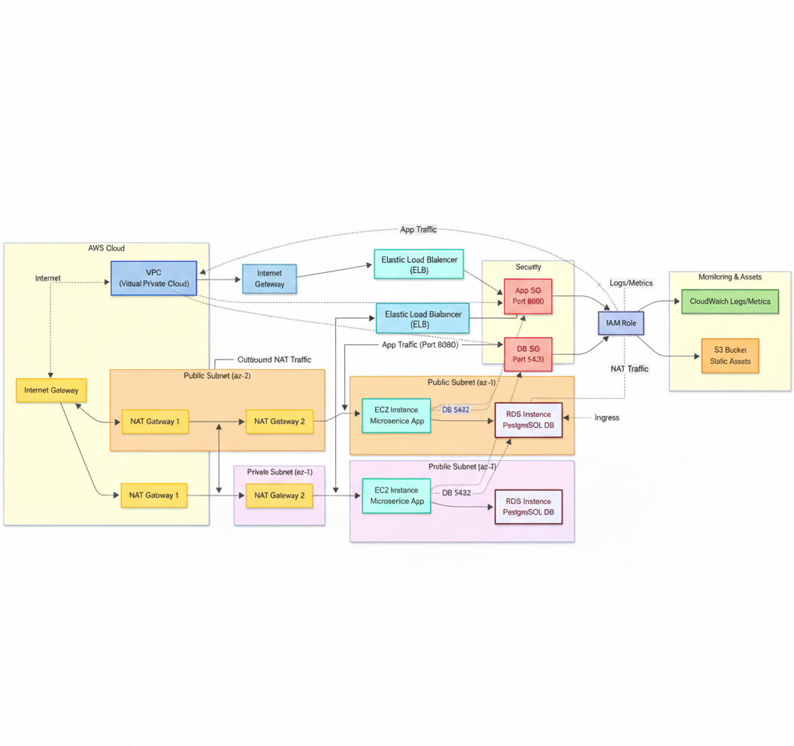
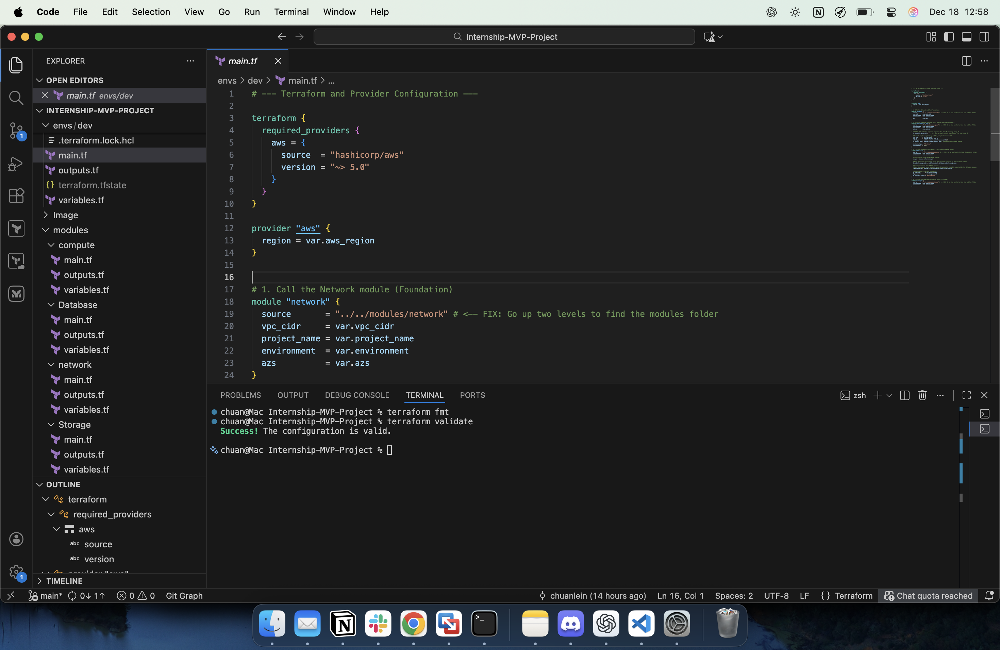
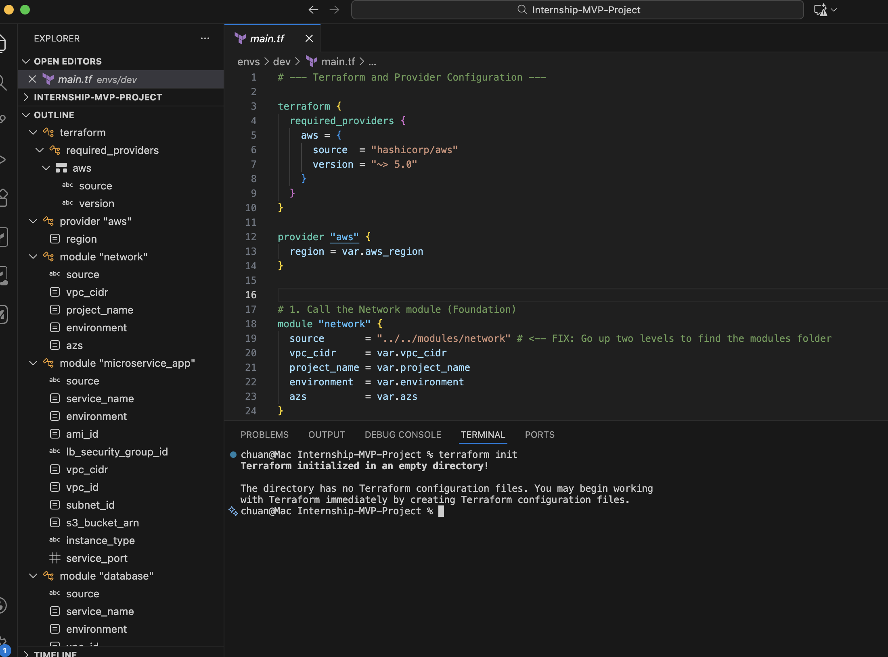
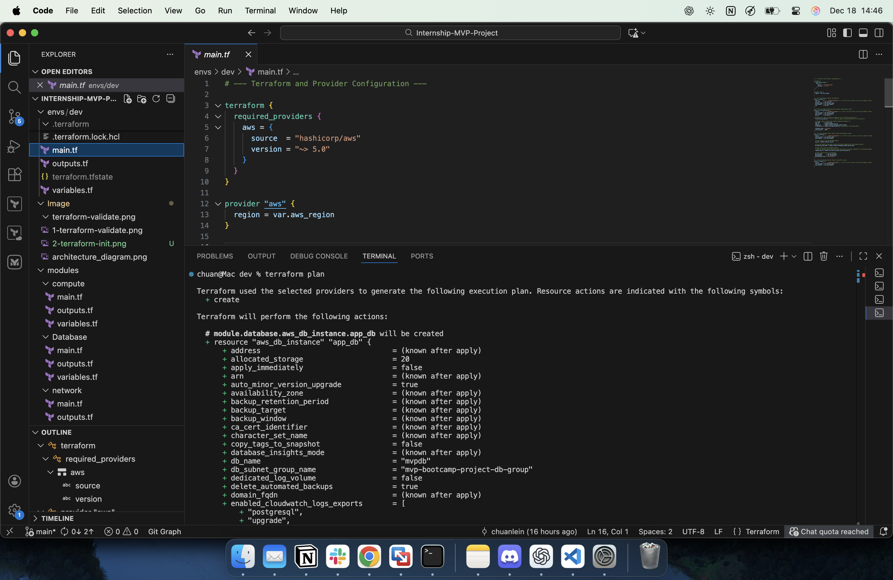
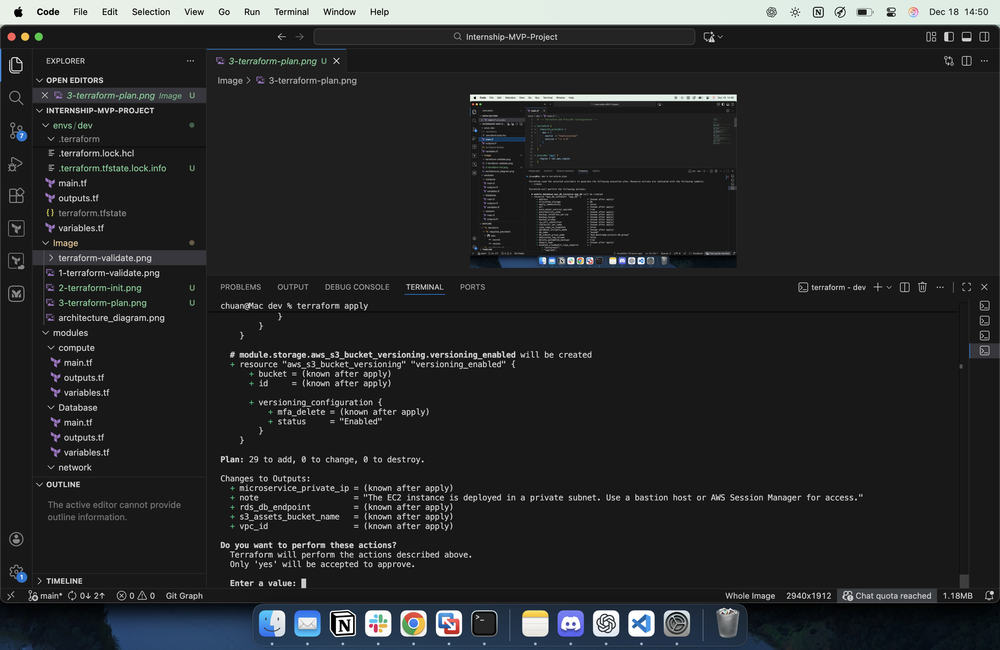
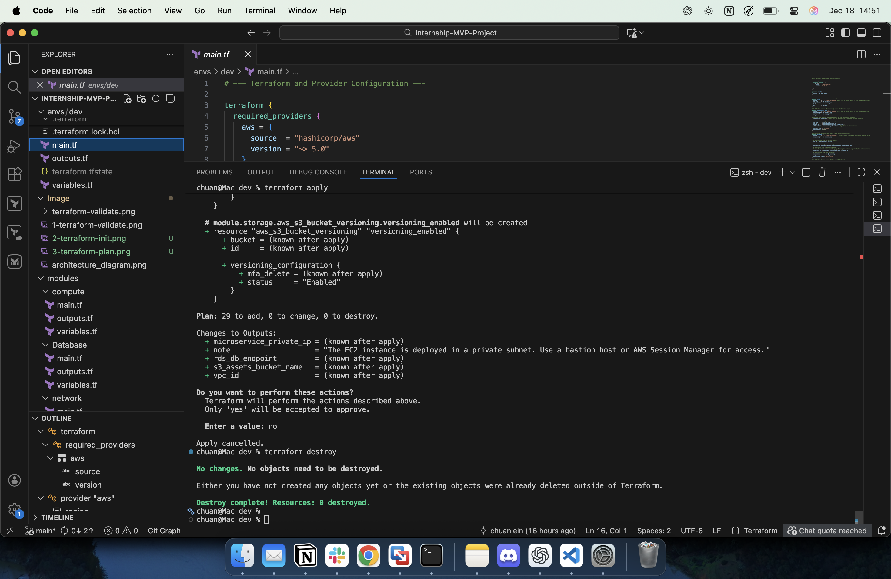

# 📝 MVP Infrastructure Model: Microservice with RDS and S3

## 🎯 Objective

This project models a small, realistic Minimum Viable Product (MVP) infrastructure on AWS using Terraform modules. The goal is to demonstrate a robust, modular, and security-conscious Infrastructure as Code (IaC) design.

## 🏗️ Architecture Diagram & Overview (Corrected to Three-Tier)

The MVP is designed as a secure, **three-tier application model** within a custom Virtual Private Cloud (VPC).

This architecture distinctly separates:

1.  **Logic Tier** (EC2 Microservice)
2.  **Data Tier** (RDS Database)
3.  **Storage Tier** (S3 Assets)
=======
The MVP is designed as a secure, three-tier application within a custom Virtual Private Cloud (VPC).




| Component | AWS Service | Purpose | Security/Access |
| :--- | :--- | :--- | :--- |
| **Network** | VPC, Subnets, NAT GW | Provides an isolated virtual network environment. | Multi-AZ (High Availability), Private Subnets for all core resources. |
| **Compute/Logic** | EC2 Instance | Hosts the microservice application/logic layer. | Resides in a **Private Subnet**; application access restricted *only* to the Load Balancer Security Group. |
| **Database/Data** | RDS (PostgreSQL) | Provides secure, persistent data storage. | Resides in a **Private Subnet**; accessible *only* from the Compute Security Group. |
| **Storage/Asset** | S3 Bucket | Stores static assets, user uploads, or logs. | **Public Access Blocked**; access granted *only* via the EC2 Instance's IAM Role (Least Privilege). |

## 📁 Terraform Module Structure (Refactored for Environments)

The project adheres to modular best practices, utilizing an `envs/dev` directory for configuration execution.

```
mvp-bootcamp-project/
├── envs/
│   └── dev/            # Execution environment (run terraform commands here)
│       ├── main.tf     # Orchestrates and connects all modules (uses ../../modules)
│       ├── variables.tf# Root input configuration
│       └── outputs.tf  # Exports connection endpoints and metadata
└── modules/
    ├── compute/        # EC2 Instance, App Security Group, IAM Role
    ├── network/        # VPC, Subnets, Internet/NAT Gateway, Route Tables
    ├── database/       # RDS Instance, DB Security Group, DB Subnet Group
    └── storage/        # S3 Bucket with secure configuration
```

## ✨ Key Design Decisions & Best Practices

| Area | Decision/Practice | Rationale |
| :--- | :--- | :--- |
| **Modularization** | Separate modules used for `network`, `compute`, `database`, and `storage`. | Improves reusability, simplifies testing, and enforces clear boundaries for configuration changes. |
| **Refactoring** | Configuration files moved to `envs/dev/`. | Separates environment configuration from reusable module code, supporting future environments (stage, prod). |
| **Networking** | Use of **Private Subnets** for EC2 and RDS. | Core resources are isolated from direct public internet access. |
| **Security Groups** | **Strict Least Privilege access control.** | EC2 Security Group is restricted to ingress *only* from the Load Balancer SG. RDS allows ingress *only* from the EC2 SG. |
| **IAM** | Use of an **IAM Instance Profile** with the EC2 instance. | Enables the application to securely interact with S3 using temporary credentials, avoiding static key storage. |
| **Database** | RDS deployed as `multi_az = true`. | Simulates production resilience with automatic failover. |
| **S3 Storage** | Enabled `block_public_access` and `versioning`. | Prevents accidental public exposure and protects against data loss. |
| **Tagging** | Consistent `Name` and `Environment` tags on all major resources. | Essential for cost allocation and resource management. |

## 🔑 Conceptual State Management

### Security and Access Notes (Crucial Updates)

**Access to Private EC2 Instances (Microservice Layer)**

Following AWS security best practices, the EC2 instances residing in the private subnets have **no direct SSH (Port 22) ingress** configured on their security group.

  * **Application Ingress Fix:** The EC2 Security Group is explicitly configured to only allow application traffic (Port 8080) from a specific **Load Balancer Security Group ID** (`var.lb_security_group_id`), preventing arbitrary access.

  * **Conceptual Access:** In a production environment, management access would be facilitated via AWS Session Manager (SSM) or a dedicated Bastion Host/Jump Box within the public subnet.

**Database Access**

The RDS database is strictly private and only accepts connections from the application's EC2 Security Group, ensuring the database is not exposed even within the VPC.

### Backend Strategy:

In a production environment, the Terraform state (`terraform.tfstate`) would be stored remotely using an **S3 Backend** and **DynamoDB Locking**.

  * **S3:** Provides reliable, versioned storage for the state file.
  * **DynamoDB:** Used to acquire a lock on the state file during any Terraform operation to prevent state corruption.

### Terraform Configuration:

The root `main.tf` file would include a `terraform` block similar to this (conceptually):

```terraform
terraform {
  backend "s3" {
    bucket         = "tf-state-bucket-unique-name"
    key            = "mvp/network/terraform.tfstate"
    region         = "us-east-1"
    dynamodb_table = "terraform-locks"
    encrypt        = true
  }
}
```

## 📸 Terraform Workflow Screenshots

Below are the key Terraform commands executed to validate and manage the MVP infrastructure:

### 1\. Terraform Format and Validate

Formates and Validates the syntax and configuration of all Terraform files.


### 2\. Terraform Init

Initializes the Terraform working directory, preparing it for other commands.


### 3\. Terraform Plan

Generates an execution plan showing all resources that will be created, modified, or destroyed.


### 4\. Terraform Apply

Prints out the execution plan and ask you to confirm the changes before it applies them.


### 5\. Terraform Destroy

Removes all resources managed by Terraform.
