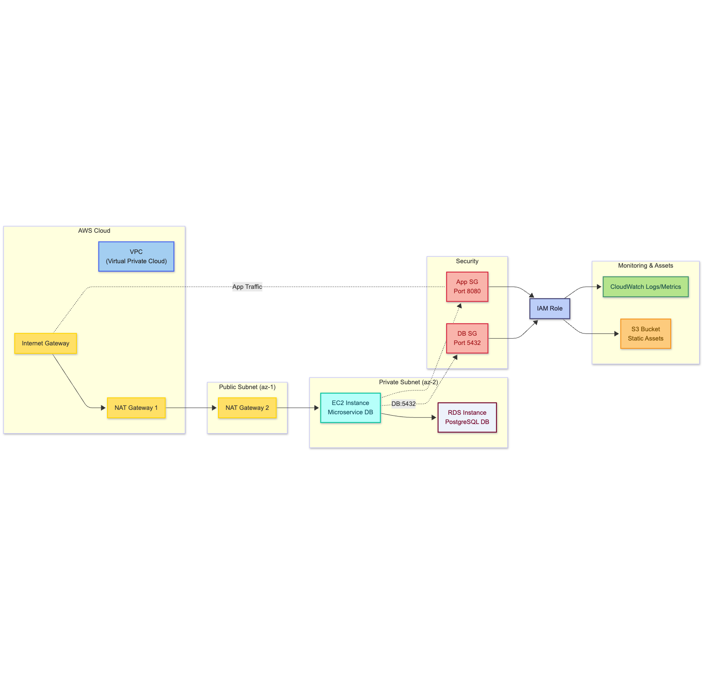
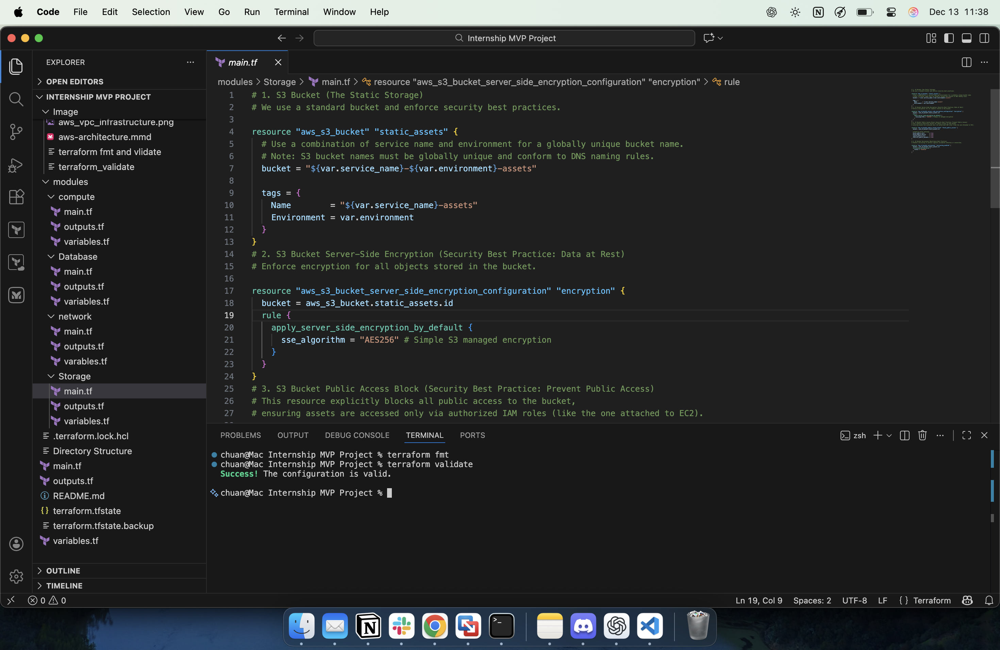
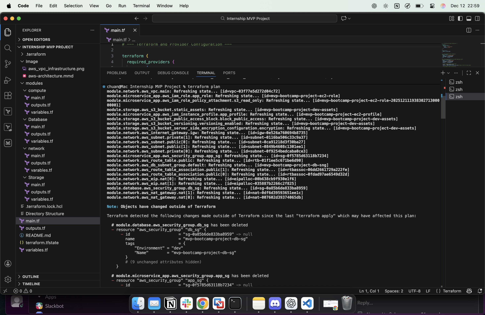
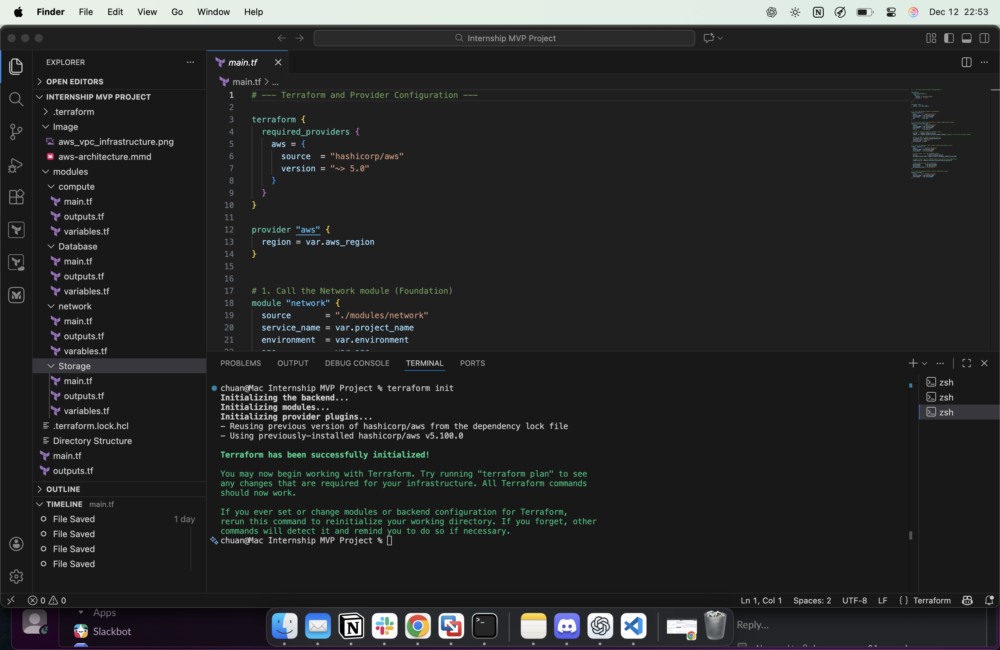
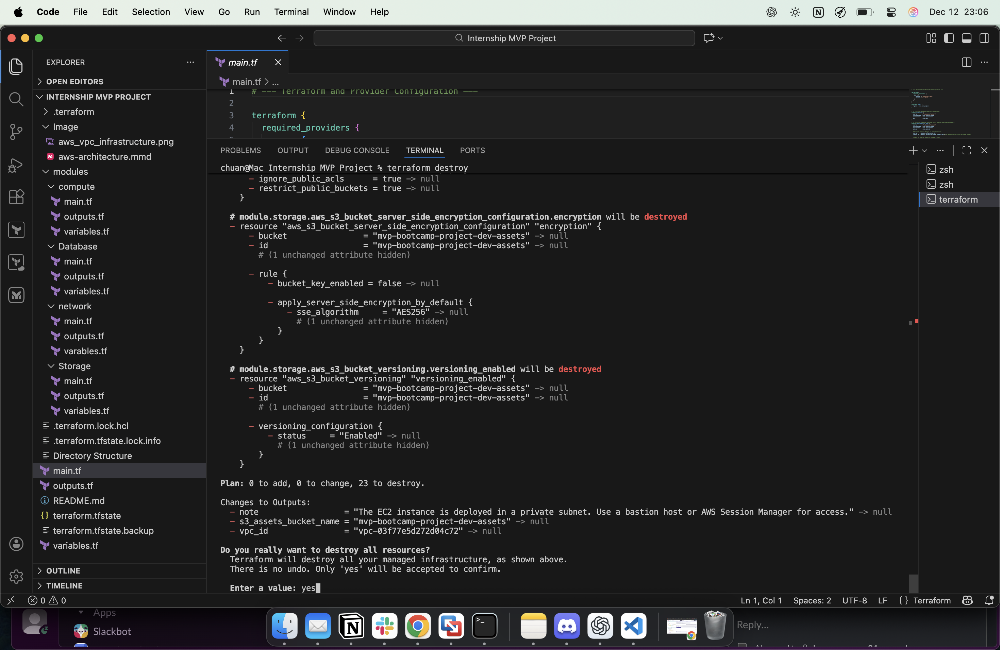

# 📝 MVP Infrastructure Model: Microservice with RDS and S3

## 🎯 Objective

This project models a small, realistic Minimum Viable Product (MVP) infrastructure on AWS using Terraform modules, without performing actual deployment. The goal is to demonstrate a robust, modular, and security-conscious Infrastructure as Code (IaC) design.

## 🏗️ Architecture Diagram & Overview

The MVP is designed as a secure, two-tier application within a custom Virtual Private Cloud (VPC).



| Component | AWS Service | Purpose | Security/Access |
| :--- | :--- | :--- | :--- |
| **Network** | VPC, Subnets, NAT GW | Provides an isolated virtual network environment. | Multi-AZ (High Availability), Private Subnets for all resources. |
| **Compute** | EC2 Instance | Hosts the microservice application layer. | Resides in a **Private Subnet**; SSH/App access controlled by Security Groups. |
| **Database** | RDS (PostgreSQL) | Provides secure, persistent data storage. | Resides in a **Private Subnet**; accessible *only* from the Compute Security Group. |
| **Storage** | S3 Bucket | Stores static assets, user uploads, or logs. | **Public Access Blocked**; access granted *only* via the EC2 Instance's IAM Role (Least Privilege). |

## 📁 Terraform Module Structure

The project strictly adheres to modular best practices, separating concerns into dedicated directories:

```
mvp-bootcamp-project/
├── main.tf             # Orchestrates and connects all modules
├── variables.tf        # Root input configuration
├── outputs.tf          # Exports connection endpoints and metadata
└── modules/
    ├── compute/        # EC2 Instance, App Security Group, IAM Role
    ├── network/        # VPC, Subnets, Internet/NAT Gateway, Route Tables
    ├── database/       # RDS Instance, DB Security Group, DB Subnet Group
    └── storage/        # S3 Bucket with secure configuration
```

## ✨ Key Design Decisions & Best Practices

| Area | Decision/Practice | Rationale |
| :--- | :--- | :--- |
| **Modularization** | Separate modules used for `network`, `compute`, `database`, and `storage`. | Improves reusability, simplifies testing, and enforces clear boundaries for configuration changes. |
| **Networking** | Use of **Private Subnets** for EC2 and RDS. | Core resources are isolated from direct public internet access, minimizing the attack surface. |
| **Security Groups** | **Least Privilege access control.** | The RDS Security Group allows ingress *only* from the EC2 Security Group, ensuring only the application layer can connect to the database. |
| **IAM** | Use of an **IAM Instance Profile** with the EC2 instance. | Enables the application to securely interact with S3 and CloudWatch using temporary credentials, avoiding the need to store static AWS keys on the server. |
| **Database** | RDS deployed as `multi_az = true`. | Conceptual resilience to simulate a production-ready setup with automatic failover to another Availability Zone (AZ). |
| **S3 Storage** | Enabled `block_public_access` and `versioning`. | Prevents accidental public exposure of assets and protects against data loss/overwrites. |
| **Tagging** | Consistent `Name` and `Environment` tags on all major resources. | Essential for cost allocation, resource management, and automated cleanup scripts. |

## 🔑 Conceptual State Management

Since this is a sandbox exercise with no deployment, state management is conceptual.

### Backend Strategy:

In a production environment, the Terraform state (`terraform.tfstate`) would be stored remotely using an **S3 Backend** and **DynamoDB Locking**.

  * **S3:** Provides reliable, versioned storage for the state file, making it accessible to team members and CI/CD systems.
  * **DynamoDB:** Used to acquire a lock on the state file during any Terraform operation (plan, apply), preventing multiple users or processes from corrupting the state simultaneously.

### Terraform Configuration:

The root `main.tf` file would include a `terraform` block similar to this (conceptually):

```terraform
terraform {
  backend "s3" {
    bucket         = "tf-state-bucket-unique-name"
    key            = "mvp/network/terraform.tfstate"
    region         = "us-east-1"
    dynamodb_table = "terraform-locks"
    encrypt        = true
  }
}
```

## 📸 Terraform Workflow Screenshots

Below are the key Terraform commands executed to validate and manage the MVP infrastructure:

### 1. Terraform Validate
Validates the syntax and configuration of all Terraform files to ensure they are correct before deployment.



### 2. Terraform Plan
Generates an execution plan showing all resources that will be created, modified, or destroyed.



### 3. Terraform Init
Initializes the Terraform working directory, preparing it for other commands.



### 4. Terraform Destroy
Removes all resources managed by Terraform, used for cleanup or teardown operations.


