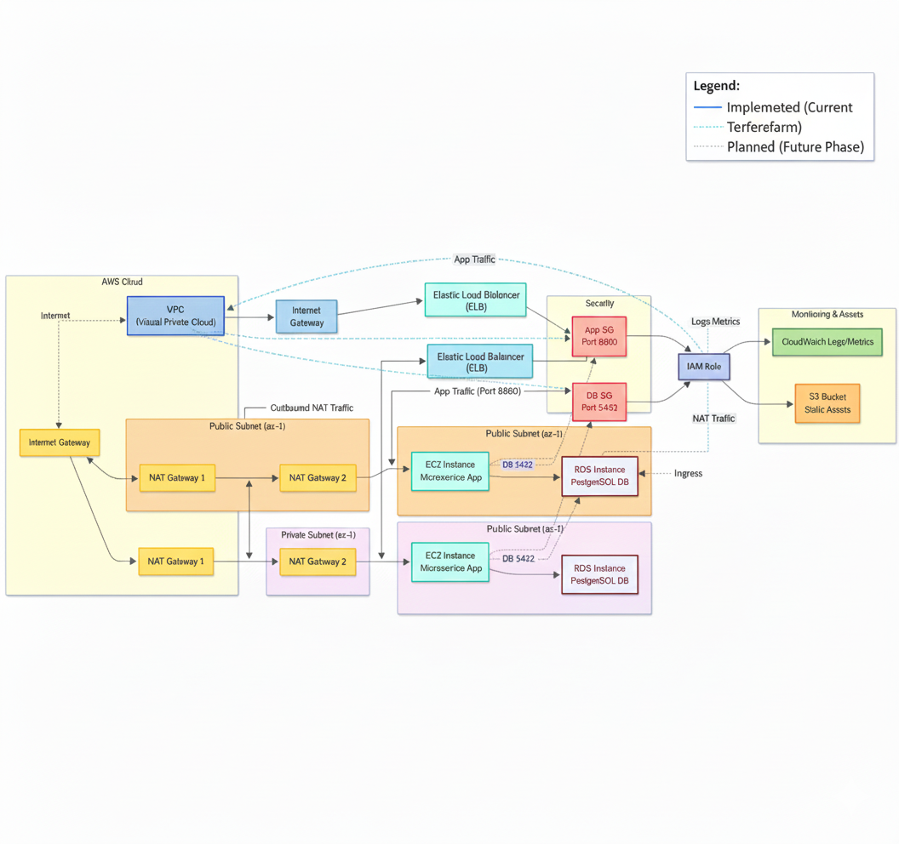
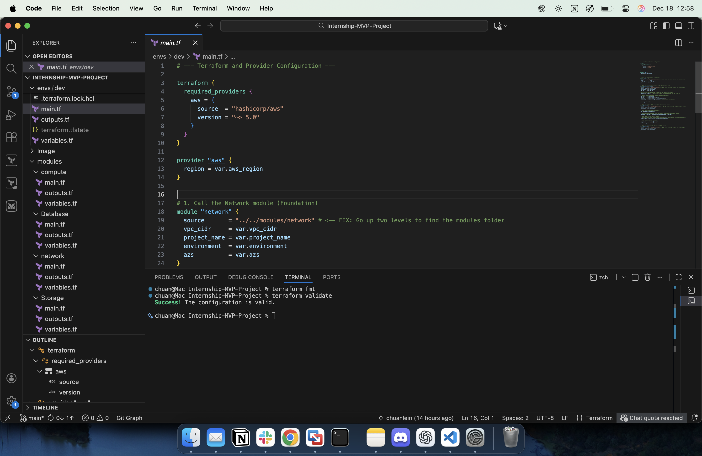
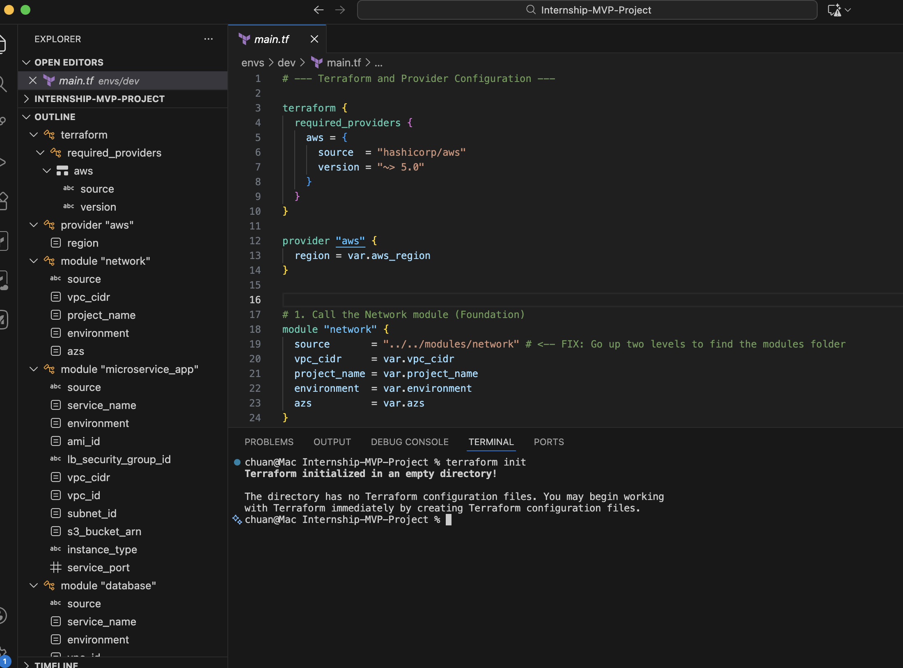
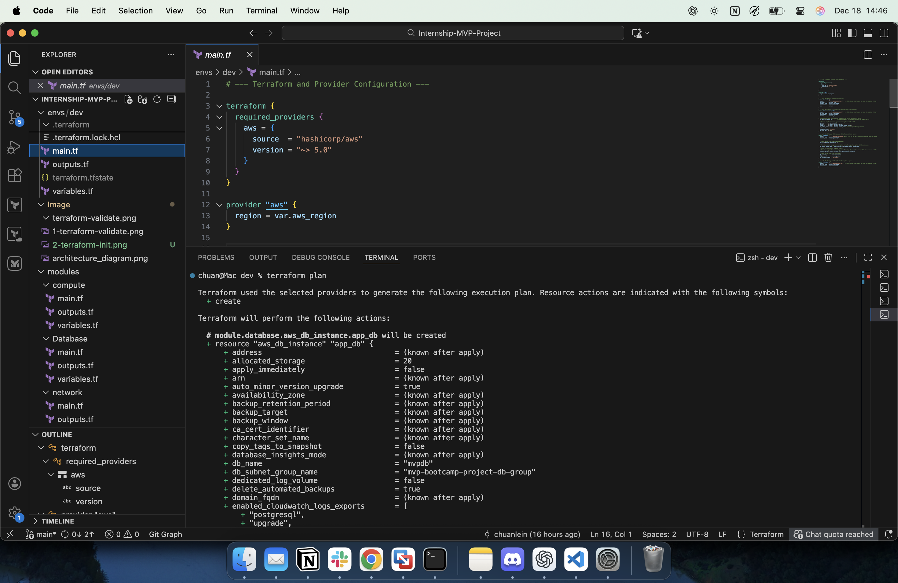
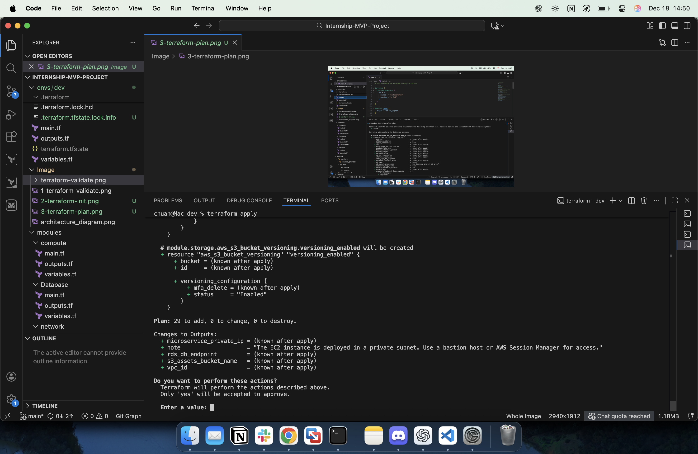
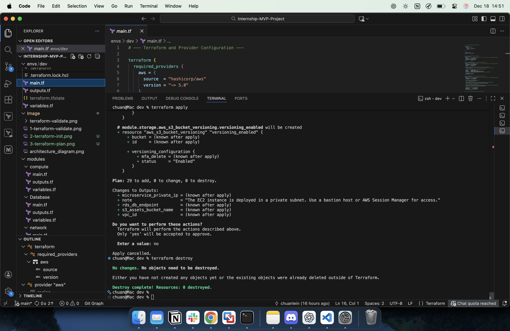

# 📝 MVP Infrastructure Model: Microservice with RDS and S3

## 🎯 Objective

This project models a small, realistic Minimum Viable Product (MVP) infrastructure on AWS using Terraform modules. The goal is to demonstrate a robust, modular, and security-conscious Infrastructure as Code (IaC) design.

## 🏗️ Architecture Diagram & Overview

The MVP is designed as a secure, **three-tier application model** within a custom Virtual Private Cloud (VPC).



| Component | AWS Service | Status | Security/Access |
| --- | --- | --- | --- |
| **Network** | VPC, Subnets, NAT GW | **Deployed** | Multi-AZ (High Availability), Private Subnets for all core resources. |
| **Compute/Logic** | EC2 Instance | **Deployed** | Resides in a **Private Subnet**; application access restricted *only* to the Load Balancer Security Group. |
| **Database/Data** | RDS (PostgreSQL) | **Deployed** | Resides in a **Private Subnet**; accessible *only* from the Compute Security Group. |
| **Storage/Asset** | S3 Bucket | **Deployed** | **Public Access Blocked**; access granted via the EC2 Instance's IAM Role. |

## 📁 Terraform Module Structure

The project utilizes an `envs/dev` directory to separate environment-specific configuration from reusable module logic.

```
mvp-bootcamp-project/
├── envs/
│   └── dev/            # Execution environment
│       ├── main.tf     # Orchestrates modules (uses ../../modules)
│       ├── variables.tf# Environment input configuration
│       └── outputs.tf  # Connection endpoints and metadata
└── modules/
    ├── compute/        # EC2 Instance, App Security Group, IAM Role
    ├── network/        # VPC, Subnets, Internet/NAT Gateway, Route Tables
    ├── database/       # RDS Instance, DB Security Group, DB Subnet Group
    └── storage/        # S3 Bucket with secure configuration

```

## ✨ Key Design Decisions & Best Practices

| Area | Decision/Practice | Rationale |
| --- | --- | --- |
| **Modularization** | Separate service modules. | Improves reusability and simplifies testing. |
| **Refactoring** | Config files in `envs/dev/`. | Best practice for supporting future environments like `staging` or `prod`. |
| **Networking** | **Private Subnets** for EC2/RDS. | Resources are isolated from direct public internet access. |
| **Security Groups** | **Least Privilege access.** | EC2 accepts traffic only from a (planned) Load Balancer; RDS only from EC2. |
| **IAM** | **IAM Instance Profile.** | EC2 interacts with S3 using temporary credentials rather than static keys. |

## 🚀 Roadmap & Future Improvements

To maintain transparency between the documentation and the codebase, the following features are identified as **Planned/Future State**:

* **Application Load Balancer (ALB):** The infrastructure is "ALB-Ready." The `compute` module currently accepts a placeholder `lb_security_group_id` in preparation for this tier.
* **Monitoring & CloudWatch:** IAM roles and logging paths are defined; full dashboard implementation is a future milestone.
* **AWS Session Manager (SSM):** Planned as the secure method for shell access since direct SSH is disabled.

## 🔑 Conceptual State Management

### Security and Access Notes

**Access to Private EC2 Instances (Microservice Layer)**
Following security best practices, EC2 instances have **no direct SSH (Port 22) ingress**.

* **App Ingress:** The EC2 Security Group is configured to only allow Port 8080 from a specific Load Balancer SG.
* **Conceptual Access:** In production, management would be performed via **AWS Session Manager** or a **VPN**.

**Database Access**
The RDS is strictly private and only accepts connections from the application's EC2 Security Group.

### Backend Strategy

In production, the Terraform state would be stored remotely using an **S3 Backend** and **DynamoDB Locking** to prevent state corruption.


### Terraform Configuration:

The root `main.tf` file would include a `terraform` block similar to this (conceptually):

```terraform
terraform {
  backend "s3" {
    bucket         = "tf-state-bucket-unique-name"
    key            = "mvp/network/terraform.tfstate"
    region         = "us-east-1"
    dynamodb_table = "terraform-locks"
    encrypt        = true
  }
}
```

## 📸 Terraform Workflow Screenshots

Below are the key Terraform commands executed to validate and manage the MVP infrastructure:

### 1\. Terraform Format and Validate

Formates and Validates the syntax and configuration of all Terraform files.


### 2\. Terraform Init

Initializes the Terraform working directory, preparing it for other commands.


### 3\. Terraform Plan

Generates an execution plan showing all resources that will be created, modified, or destroyed.


### 4\. Terraform Apply

Prints out the execution plan and ask you to confirm the changes before it applies them.


### 5\. Terraform Destroy

Removes all resources managed by Terraform.
